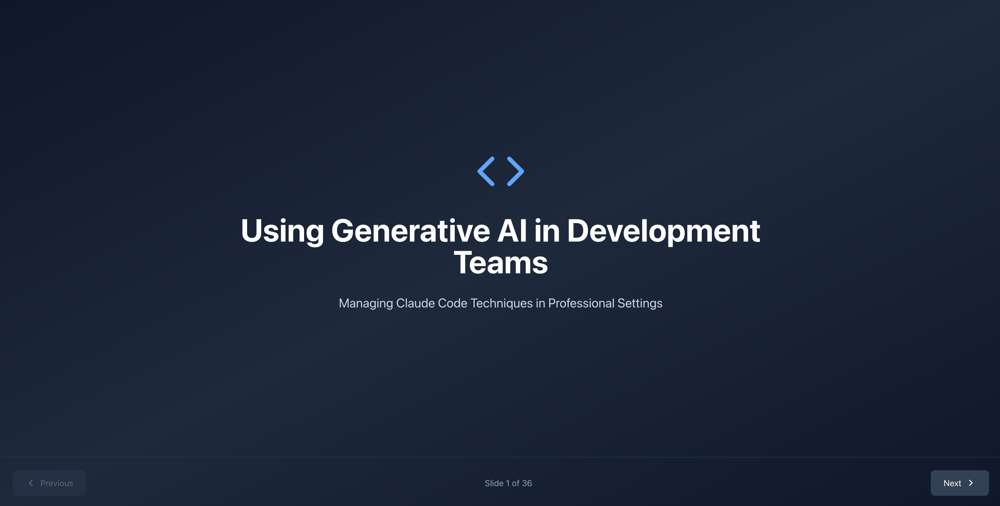

# Using Generative AI in Development Teams

This presentation explores professional techniques for using Claude Code in development teams, moving beyond "vibe coding" to structured, production-ready workflows. It covers core techniques like context engineering, Plan Mode, CLAUDE.md files, advanced concepts like subagents and Skills, and practical best practices for scaling AI-assisted development in professional settings.

## First Slide

## Running the Presentation

This project was bootstrapped with Create React App.

### `npm start`

Runs the app in development mode. Open [http://localhost:3000](http://localhost:3000) to view it in your browser.

Navigate through slides using:
- Arrow keys (← →)
- Previous/Next buttons
- The presentation contains 36 slides covering topics from fundamentals to advanced techniques
